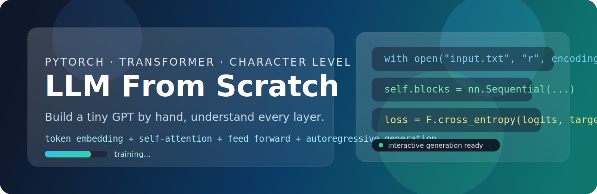
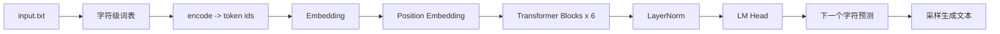

<div align="center">
  
</div>

<div align="center">

# LLM From Scratch

一个用 `PyTorch` 从零手搓出来的字符级 Transformer / MiniGPT 项目。  
从文本读入、字符编码、位置编码，到 `Self-Attention`、前馈网络、训练循环和推理生成，核心链路都自己写了一遍。


</div>

## 项目简介

这个项目更偏向「动手理解大模型」而不是「调用现成封装」。

你能在这里看到一个最小但完整的语言模型训练流程：

- 从 `input.txt` 读取语料并构建字符级词表
- 手写 `encode / decode`
- 随机切分训练集与验证集
- 自己实现单头注意力、多头注意力、前馈网络和 Transformer Block
- 训练一个可交互生成文本的 `MiniGPTLanguageModel`
- 直接在命令行里和模型对话

如果你也在学大模型底层，这种项目特别适合用来把概念真正串起来。

## 为什么这个项目值得看

- `从零理解`：不是套框架教程，而是把核心模块一块块搭起来
- `结构清晰`：单文件版本很适合顺着代码一路读透
- `上手直接`：准备好 `input.txt` 就能训练和生成
- `适合二创`：后续很容易继续扩展成分词版、检查点版、多文件工程版

## 模型结构



## 当前实现

根据当前脚本里的配置，这个项目已经包含了这些关键部分：

| 模块 | 当前实现 |
| --- | --- |
| 词表方式 | 字符级 |
| 框架 | PyTorch |
| 上下文长度 | `block_size = 32` |
| Batch Size | `batch_size = 16` |
| Embedding 维度 | `n_embd = 128` |
| Attention Head 数 | `n_head = 8` |
| Transformer 层数 | `n_layer = 6` |
| 优化器 | `AdamW` |
| 训练轮次 | `max_iters = 5000` |
| 生成方式 | 自回归逐 token 采样 |

## 项目结构

```text
llm/
├── assets/
│   └── banner.svg
├── haiy.py        # 主训练与推理脚本
├── input.txt      # 训练语料
├── README.md
└── .gitignore
```

## 快速开始

### 1. 安装依赖

```bash
pip install torch
```

### 2. 准备语料

把你想训练的文本放进根目录下的 `input.txt`。

### 3. 运行项目

```bash
python haiy.py
```

脚本会完成：

1. 读取文本并建立字符映射
2. 初始化模型
3. 开始训练
4. 进入命令行交互生成模式

输入 `quit` 可以退出对话。

## 适合继续升级的方向

- 加 `requirements.txt` 和环境说明
- 支持模型参数保存与加载
- 增加 `train.py / chat.py` 拆分结构
- 加入 loss 曲线可视化
- 支持 BPE / Tokenizer，而不只是字符级
- 增加温度采样、top-k、top-p
- 增加 checkpoint 与断点续训

## 这个仓库适合谁

- 想真正弄懂 Transformer 基本结构的人
- 想做一个自己的「手搓大模型」作品集项目的人
- 想从教学代码过渡到工程化项目的人

## 说明

这是一个很适合学习和展示思路的项目版本。  
如果后面你想继续升级成更完整的仓库，我建议下一步优先做两件事：

- 把训练和推理拆成两个文件
- 增加模型保存 / 加载功能

这样 GitHub 首页会更好看，项目本身也会更像一个完整作品。
